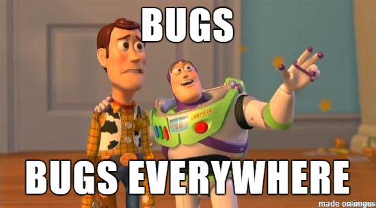

# Bugs sandbox

  

Bugs podem acontecer a qualquer momento. Portanto, precisamos treinar para saber como organizar e resolvê-los da melhor forma. O GitHub é a ferramenta ideal para organizarmos todas as issues de um projeto, informando todos os bugs que precisam ser resolvidos, além de novas funcionalidades e possíveis alterações. Com o issue tracker, conseguimos dividir as responsabilidades por cada membro do nosso time.

Este Sandbox serve como um repositório de treinamento que iniciou com códigos em diferentes linguagens contendo alguns bugs que podem ser corrigidos. Foram criadas algumas issues relacionadas à estes bugs e outras correções e estas issues serão divididas entre os membros da turma para uma atividade prática.

As issues existentes não precisam ser as únicas. Podem haver outras melhorias que os alunos podem encontrar e criar novas issues relacionadas a estas melhorias. É um repositório livre para treinarmos nossos conhecimentos.

Have fun!
